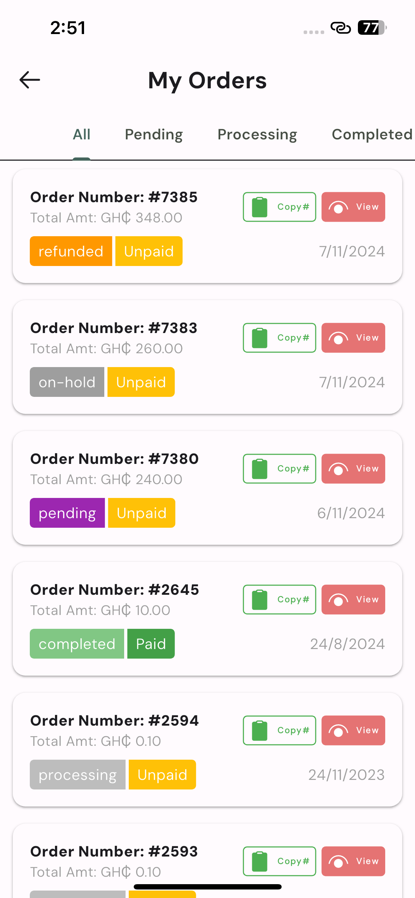
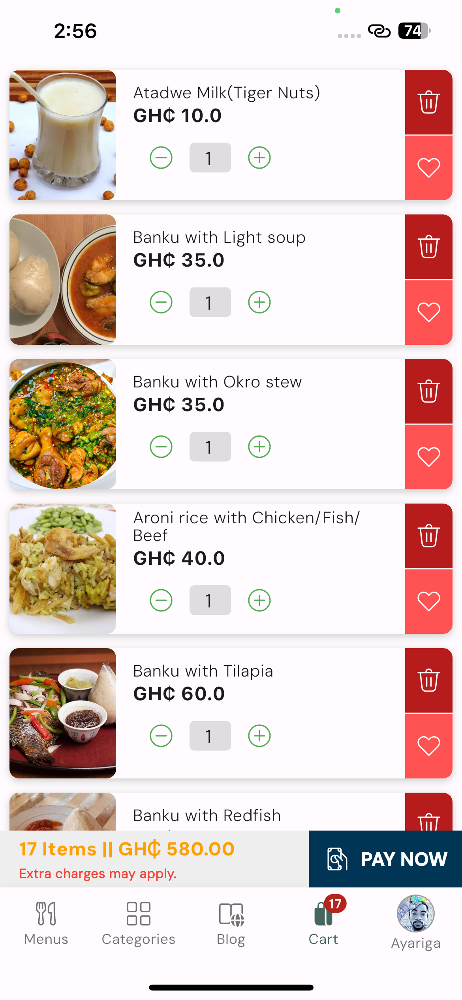
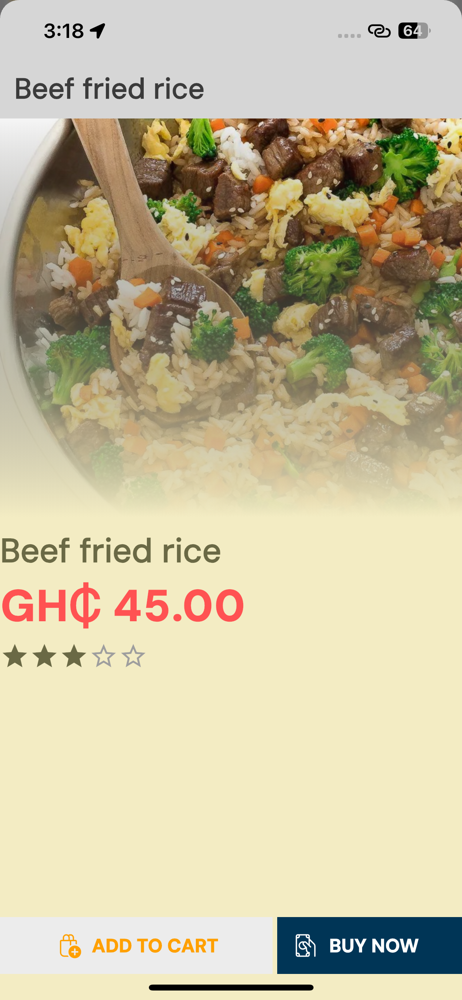
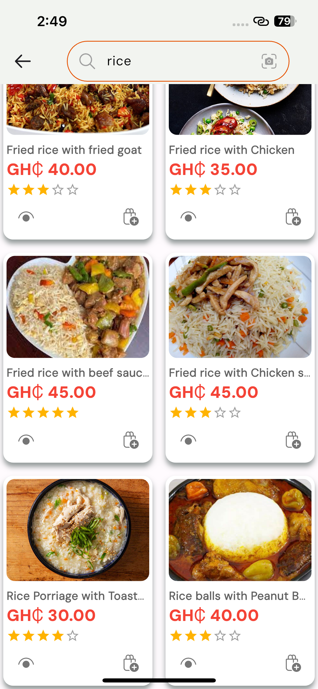
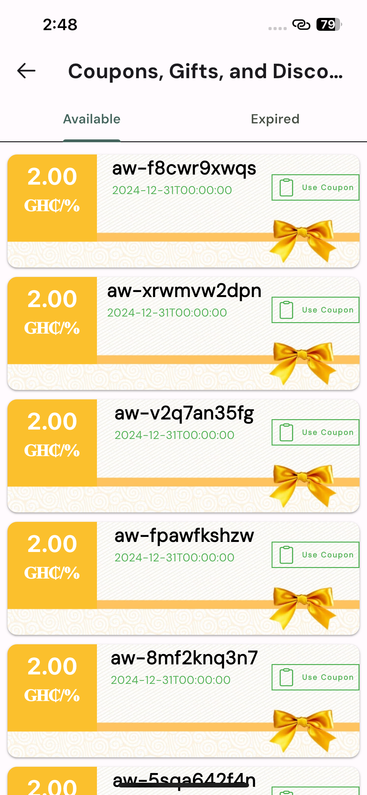

# 🍽️ Chewey

**Restaurant Order Management Reimagined**  
*A taste of restaurant order management with hot features.*

<p align="center">
  
</p>

<div align="center">
  
  
  
  
  
  
  
  

</div>

---

## 🌟 Featured Screens

<div align="center" style="display: flex; flex-wrap: wrap; gap: 10px; justify-content: center;">

|  |  |  |
| :------------------------: | :--------------------------------: | :------------------------: |
|      **Dynamic Home**      |        **Order Management**        |       **Smart Cart**       |

|  |  |  |
| :----------------------------: | :------------------------------------: | :-------------------------------------: |
|      **Product Gallery**       |           **Instant Search**           |             **Promotions**              |

</div>

---

## ⚠️ IMPORTANT NOTICE

- Chewey uses **WordPress** and **WooCommerce** as its backend.
- While it can be adapted for other types of businesses, the **core focus is restaurant management**.
- All **feature requests, bug reports, or issues** must go through [GitHub Issues](../../issues).
- We develop this project **as a hobby** — it’s open-source but not open-support.
- For **support, theming, installations**, or **App Store/Play Store listings**,  
  👉 [Contact us *(THIS IS PAID SERVICE)*](mailto:info@naabatechs.com).

---

## 🚀 Core Features

<div style="columns: 2; column-gap: 20px;">
  
✔ 🛜 **Real-Time Order Sync**  
✔ 🛍️ Market Integrated WooCommerce Backend  
✔ 🔥 Smart order management  
✔ 📦 Real-time kitchen updates  
✔ 🛵 Delivery and pickup tracking  
✔ 📊 Daily insights & reports  
✔ 👥 Authentication and user management  
✔ ✅ State management  
✔ 💳 Payment integration (currently supports **Paystack** only)  
✔ 🎁 Coupons, gifts, and discount management  
✔ 🔐 Local authentication and security  
✔ 💬 In-app push notifications  
✔ 🌗 Clean and responsive UI (Light & Dark Mode)  

</div>

---
## 🧠 Up-coming features

- 🧾 POS hardware and software integrations
- 💳 More payment gateways
- ✉️ SMS and email notifications
- 🛠️ Custom WordPress UI controls
- 🔐 Enhanced security modules
- 🔌 Custom WordPress plugin for full backend feature control
- 🎉 Loyalty & promotions system
---

## 🛠 Tech Stack

```text
📦 Codebase    │ Flutter 3.19 (Dart 3.3)
🛠️ Backend     │ WordPress 6.5 + WooCommerce 8.6
📱 Platforms   │ iOS & Android (Single Codebase)
🧩 Plugins     │ flutter_bloc, dio, shared_prefs
✅ Last Test   │ All 127 tests passing (May 2024)
```

---
## 📸 App Showcase

All preview images, illustrations, and mockups used in this project are located in the `showcase/` directory: *See full collection in [showcase directory](showcase/)*

---
## 📦 Clone & Run

```bash
git clone https://github.com/naabatechs/chewey.git
cd chewey && flutter pub get
flutter run # Run the app